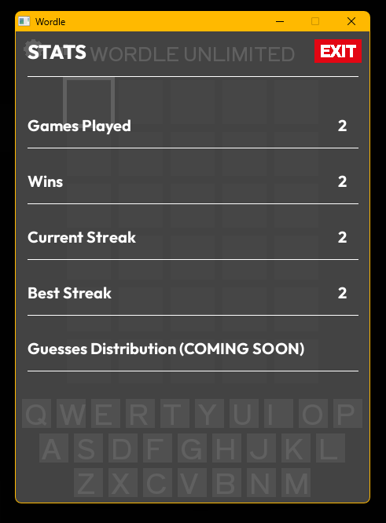

# Wordle

This project is a Wordle clone, is coded in C, and uses the SDL3 library. Fun fact: This is my first coding project in C. It is also my biggest coding project ever.

 

<h1>How it looks</h1>

 

<h1>Installation minimum requirements</h1>

<ul>
  <li>OS: Windows, Mac (untested), Linux (untested)</li>
  <li>Specs: a computer</li>
  <li>Libraries: None (even when building; SDL3 included)</li>
</ul>

 

<h1>How to install</h1>

If you want to play without having to build the project, click <a href="https://github.com/kensoto-martinez/wordle-sdl3/tags">here</a>, choose the latest version, and download either wordle.zip or wordle-windows.zip. Just launch the executable after extracting and you're all set. If you want to build or edit the project, download the source code.

 

<h1>How to build</h1>

If you are building, you have two options: a Makefile and a Batchscript. I suggest the Makefile. To build, just run either one inside your terminal. You will need a Unix terminal (e.g., MSYS) to use the make command on Windows. You do not need to download SDL3 to compile the project as the project contains the entire library. You should add the "include" directory into your PATH. If you prefer to use your own SDL3 installation, you can always include the PATH to your SDL3 installation rather than mine.

 

<h1>How my game works</h1>

<h2>Controls</h2>
<ul>
  <li>Keyboard letter: Type letter</li>
  <li>Enter: Submit guess</li>
  <li>Backspace: Delete letter</li>
  <li>Arrow Keys: change focus square</li>
</ul>

<h2>How I compare the inputted word to the answer</h2>

If you don't know how to play Wordle, I put a help section in my game or you can look it up online. As you now know, in Wordle, there is a grid of squares where letters appear to form the word you input. I stored each square, the color of each, and the letters on each square if there is one in their respective arrays. Putting them in their own arrays makes it easier to loop through them all, since an index from each array corresponds to a particular square's existence, color, and letter. Because of how easy it is to loop through every square, it wasn't too complicated to not only check if a letter is present in a word, but to also account for double letters. If someone guesses "PIZZA" and the answer is "ZONED", then the colors would be {GRAY, GRAY, YELLOW, GRAY, GRAY} rather than {GRAY, GRAY, YELLOW, YELLOW, GRAY}.

<h2>Issues/Known Bugs</h2>

<h3>Word Bank</h3>

I tried to filter the guessable words accurate to the original Wordle. After I finished filtering, I realized that some words are guessable but they could never be the answer. You cannot guess plural words in my game. In v0.0.1, I will add plural words as guessable but they will never be an answer. There are some guessable words that are names or don't seem like words at all.

<h3>"Hard Mode"</h3>

While writing this, I've realized that I added a "Hard Mode" toggle but forgot to actually implement the feature. A viable strategy in Wordle is to guess filler words that have letters you're thinking could be in the word. A filler word doesn't necessarily need to include green or yellow letters. Any guess can use letters that are grayed out, grayed out meaning you guessed the letter in a previous guess and it turns out that letter isn't in the answer. This strategy is useful if you know the answer has a common prefix or suffix. "Hard Mode" makes this strategy obsolete as you wouldn't be able to use grayed out letters and you would need to use revealed green and yellow letters in your next guess.

<h3>Can open multiple menus</h3>

Currently, you can open multiple menus at once, which causes them to overlap and look messy. Try to avoid clicking buttons that open a new menu while another menu is already open.

<h2>Features</h2>

<h3>Exclusive Features</h3>

<strong>v0.0.0-alpha</strong> creates a QoL feature exclusive to my game. In the official Wordle game, to change a letter in the middle of your guess, you will need to backspace the trailing letters until you reach said letter, change it, then type the removed letters again. This is a pain if said letter is the first letter. This pain is gone in my game. I added a focus square that highlights the focused square in white. With the arrow keys, you can move the focused square to any letter in the current guess. With this, you can easily change any letter in your guess rapidly. This makes backspacing letters slightly more complicated, just know that backspacing removes the <strong>preceding</strong> letter rather than the one highlighted. If you highlight the last square and there is a letter, it removes that letter.

<h3>Features already in the official Wordle</h3>

There is a help, settings, and stats button. The help button does a decent job at teaching you the game and it also explains the arrow key feature. The settings button technically has no purpose in <strong>v0.0.0</strong>. The stats buttons fetches data from stats.csv. The stats.csv file doesn't update until you close the game, but your stats in-game do update in the stats menu.

 

<h2>Credits</h2>
<ul>
  <li>Everything: me</li>
</ul>
